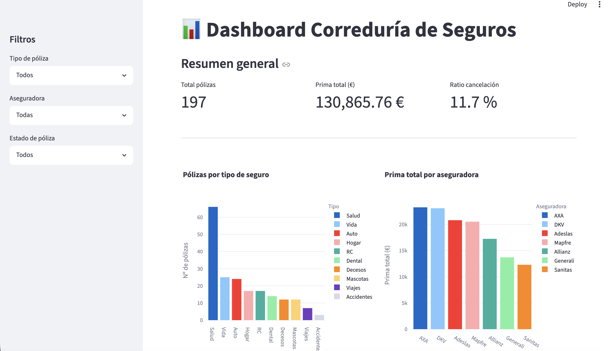

# 📊 Dashboard Correduría de Seguros

Dashboard interactivo desarrollado con Python y Streamlit que permite analizar 
la cartera de pólizas de una correduría de seguros a partir de datos reales en CSV.

## 📸 Vista previa



## 🚀 Tecnologías

- Python 3.14
- Streamlit
- Pandas
- Plotly

## 📁 Estructura del proyecto

```
correduria-dashboard/
├── data/
│   └── clientes_polizas.csv   # Dataset real de la correduría
├── src/
│   ├── init.py
│   ├── data_loader.py         # Carga y limpieza de datos
│   ├── kpis.py                # Cálculos de negocio
│   └── charts.py              # Generación de gráficos
├── app.py                     # Aplicación principal
└── requirements.txt
```

## 📈 Funcionalidades

- KPIs en tiempo real: total de pólizas, prima total y ratio de cancelación
- Filtros interactivos por tipo de póliza, aseguradora y estado
- Gráfico de evolución de altas por mes
- Distribución de pólizas por tipo de seguro
- Cartera por aseguradora (prima total)
- Distribución por canal de captación

## 🧹 Limpieza de datos aplicada

El dataset original contiene registros con primas anuales negativas (dato inválido
en el dominio de seguros). El módulo `data_loader.py` los filtra automáticamente
y convierte las fechas al tipo correcto, reduciendo el dataset de 200 a 197 registros
válidos.

## ▶️ Cómo ejecutar

```bash
# Instalar dependencias
pip install -r requirement
s.txt

# Lanzar la aplicación
streamlit run app.py
```

La app estará disponible en `http://localhost:8501`
